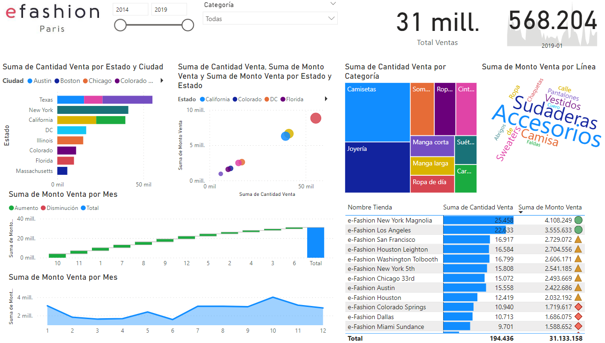

# MACI-BI

## Clase Práctica 2
C2Lab1_Efashion.xlsx
Descripción Excel: Ventas (Monto y cantidades) de artículos por categoría, tienda en un período de tiempo.

Hoja Periodo (56 filas):
- Mes
- Mes Nombre
- Año

Hoja tienda (16 filas):
- Id Tienda
- Nombre Tienda
- Ciudad
- Estado

Hoja Categoria (36 filas):
- Id Categoria
- Línea
- Categoría

Hoja Fact (9368 filas):
- Id Fact
- Id Periodo
- Id Tienda
- Id Categoria
- Monto Venta
- Cantidad venta

Trabajo clase:
- Utilizar Excel Github como origen de datos en cliente power BI
- Analizar y realizar limpieza de datos en caso que corresponda
- Preparar dimensiones y tabla de hechos para un modelo estrella (Dimensiones producto, representante, fecha y tabla de hechos)
- Relacionar tablas modelo estrella
- Desarrollar tablero Power BI

